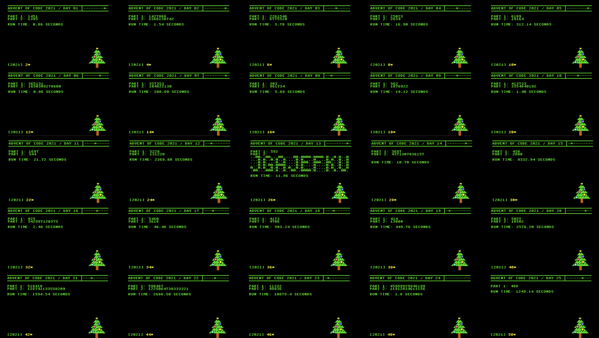
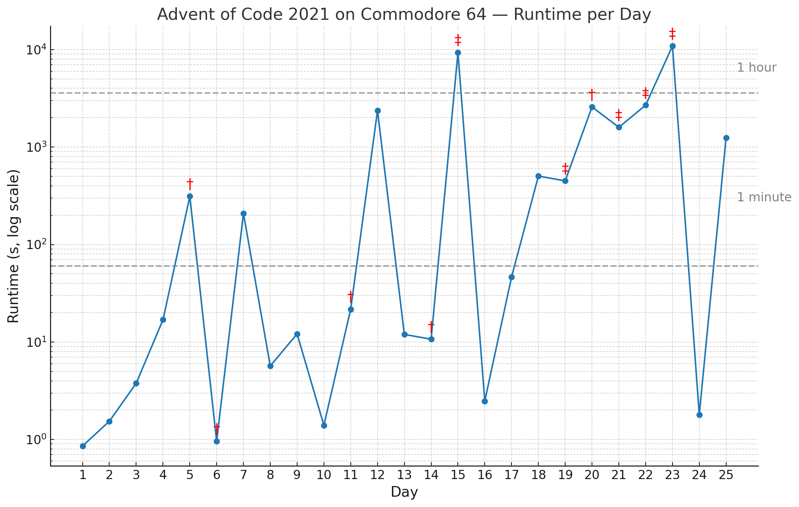

# Solving the Advent of Code 2021 in C++ on the Commodore 64

## TL;DR

- I solved the 2021 series of the Advent of Code (AoC) puzzles in C/C++ on a Commodore 64 (C64), closing the circle, and finally reaching **500 stars**.
- I was not the first one to achieve this on a C64. According to the best of my knowledge, Jukka Jylänki [did it first on the C64 in 2023](https://clb.confined.space/aoc2023/), and his magnificent and pioneering achievement was my key inspiration.
- To make the solving experience feasible and efficient, I gradually built up a helper library of the most commonly needed data structures. The library grew hand-in-hand with the puzzles. Whenever I hit a need (stack, heap, hash set, ...), I stopped, implemented it, and then reused it later whenever possible. If I noticed a bug or sub-optimal code, I fixed it.
- Some building blocks, most importantly [`reucpy.h`](lib/reucpy.h), were kindly shared with me by Jukka. Without that REU DMA helper, many solutions would just have been impractical.
- The C64 is a very limited platform. While some day's solutions take only a few seconds, or even less than a second, there are many days, especially towards the end, where the run time is measured in minutes or hours!
- I hope my journey will inspire others to try. In case you use or repurpose my work, all I'm asking for is a slight nod in my direction.
- This document is neither a tutorial nor a systematic breakdown of the solutions but more like a high-level summary with some key highlights.



---

## Introduction

The [Advent of Code](https://adventofcode.com/) series of programming puzzles has definitely re-ignited my interest for puzzles and my passion for coding. I first discovered AoC by chance in 2017. I solved that year in [R](www.r-project.org), a statistics-oriented programming language that I have been utilizing frequently at work.

In the subsequent years I continued using R, mainly because of my familiarity and fluency with it. Next year I have decided to switch to Python. Python is, after all, very well suited for such tasks. Due to lack of time I skipped a few year's event, did one year in R again, and one in Python.

Experiencing how effective Python was at parsing the inputs (some days it almost felt like cheating), expressing the algorithms, and coding the core logic, I went on binge-solving the remaining years. In doing so I mostly used Python. But then it occurred to me that I was missing an opportunity to learn new languages. Therefore I switched to Go and Rust to solve some other years. I also planned to try out C++ and JavaScript, but because I wasn't careful with my pacing, I quickly ran out of remaining unsolved years.

With only one year (2021) still remaining and two candidate languages to choose from, I made the choice and decided to solve it in C++, a language I already "knew" but hadn't used for a long time. Okay, but how did I end up on a C64, you ask? The answer is, simply, that the _**stars aligned**_:

- I received a fully functional (and nicely preserved!) C64 as a gift from my former coworkers. They knew I'm into vintage computers, so it was a really nice and fitting gift.
- I wanted to "up the ante", to use [Reddit's AoC](https://www.reddit.com/r/adventofcode/) parlance, by making the puzzles more difficult. The exercise of solving all the past years had definitely increased my skills and repertoire of key algorithms (recursion, DFS, BFS, Dijkstra, A*, memoization, modular arithmetic, ...), so the puzzles became easier and easier to solve.
- I stumbled upon the awesome pioneering achievement of Jukka Jylänki and was deeply impressed; not only did he solve all days, he also live-streamed the achievement!
- And lastly, the availability and maturity of the [llvm-mos](https://llvm-mos.org) compiler and the [VICE C64](http://vice-emu.sourceforge.net/) emulator made the whole thing feasible also from a workflow point of view. My MOS6502 assembly skills are far too limited to attempt solving anything but the simplest of the puzzles (and let's not get into the time commitment that would entail...).

Another important element was nostalgia. My first computer ever was a Commodore 128. I fondly remember using the tape drive to load and save my BASIC programs. I never had a floppy drive. And when the tape drive failed, I simply used pen and paper to "store" and "reload" my work. I got quite adept at re-typing the code from scratch from my notebook when starting a new coding session.

So while the C64 is not exactly the same as the C128, the experience evoked fond childhood memories while highlighting how much computing has progressed since then. To be able to close the AoC journey on the C64, solving contemporary puzzles using a modern language on hardware that is very similar to my first computer ever, was an opportunity impossible to pass.

The last thing to note in the introduction: please don’t expect cutting-edge modern C++. It's been almost 20 years since I've last used C++. The language has evolved substantially since then and it continues to evolve. For example, I am browsing through discussions about the latest C++23/25/26 standards and I am struggling to understand even half of the nuance.

---

## Platform Limitations

The Commodore 64 / C++ platform has multiple significant limitations that defined the boundary conditions of this experiment.

### Hardware
- **RAM**: only 64 KB addressable, minus screen/KERNAL and other reserved areas, effectively landing at slightly below 50 KB, and this includes the program executable itself, the input, and any space needed to perform the computation.
- **CPU**: MOS 6510, ~1 MHz. Anything algorithmically heavy is measured in minutes/hours.
- **Registers**: 8-bit A, X, Y; 16-bit addressing. Painful for the compiler, for sure, but luckily the compiler can also use the *zero page* (the first 256 Bytes of the C64 memory map) as additional imaginary registers for the compiler due to faster access and additional hardware addressing modes.
- **REU (optional)**: with Jukka Ylänki's `reucpy` helper, which I turned into a header-only implementation, the [REU](https://en.wikipedia.org/wiki/Commodore_REU) becomes a practical extended memory and DMA scratchpad.

### Software
- **C++ subset**: I deliberately stayed in the [orthodox subset](https://gist.github.com/bkaradzic/2e39896bc7d8c34e042b): fixed-capacity templates with a MAX_SIZE parameter, no recursion, explicit arrays and iterators.
- **No STL**: too big, too dynamic, too memory-hungry.
- **No exceptions / RTTI**: asserts were helpful for debugging, and in some cases made code slightly faster (still don't understand how that is possible ಠ_ಠ).
- **Header-only template library**: to leverage templates.
- **llvm-mos**: the key component, without a decent compiler this project would be dead in the water even before it began.
- **VICE emulator (optional)**: made executing the compiled code as simple as drag and drop.

---

## Helper Library Written Along the Way

In contrast to the basic I/O & screen helpers, the library was not something I have designed in advance of solving the puzzles. Instead, it **emerged naturally as I solved the puzzles**.  Specifically:

- **Day 09**: Needed a [`queue.h`](lib/queue.h) for BFS/flood-fill.
- **Day 10**: Needed a [`stack.h`](lib/stack.h) for bracket matching.
- **Day 12**: graph traversal forced me to write a [`hashset.h`](lib/hashset.h).
- **Day 15**: Implementing Dijkstra required a priority queue, so I implemented [`min_heap.h`](lib/min_heap.h)
- **Day 18**: Built a compact binary tree, though this one I never generalized (TODO).
- **Days 19, 21, 22, 23:** These exploded beyond 64 KB RAM. I wrote REU-backed variants:  [`stack_reu.h`](lib/stack_reu.h), [`hashmap_reu.h`](lib/hashmap_reu.h), [`hashset_reu.h`](lib/hashset_reu.h), and [`min_heap_reu.h`](lib/min_heap_reu.h).

I wrote most of the structures from scratch. For some (e.g. for the min_heap) I had to search the internet for minimum example C/C++ code and modified it for my use case.

Other relevant parts of the library:
- **Screen & I/O helpers** ([`AoC64.h`](lib/AoC64.h)) to show banners, progress indicator, and measure elapsed time.
- **Math helpers** ([`math.h`](lib/math.h)) define the MIN, MAX, ABS and SWAP macros.
- **Hashing** ([`pearson.h`](lib/pearson.h)) for compact key indexing.
- **REU operations** ([`reucpy.h`](lib/reucpy.h) to enable large datasets, using the REU as a scratch storage for arbitrary data as well as a performance hack way to quickly copy or initialize  data in main memory via REU DMA functions.

---

## Workflow & Toolchain

With the growing helper library in place, I could establish a stable workflow.

- **Editor**: [VS Code](https://code.visualstudio.com/).
- **Compiler**: [llvm-mos](https://llvm-mos.org).
- **Emulator**: [VICE](http://vice-emu.sourceforge.io/).
- **Dual builds**: All the code can be compiled and run on the host (Win 10, Microsoft Visual C++) for testing. The helpers have #ifdef's that figure out which platform is being utilized. This was helpful for debugging my solutions (no need to wait minutes or hours for the difficult challenges).
- **Workflow**:
    1. Encode the puzzle input as a header file, e.g. [`input.h`](2021/day01/input.example.h) (an important decision I have made was that I will *not* spend too much time on writing I/O procedures for reading and parsing files on the C64; I still did parsing of strings in the code, but if it was trivial to transform the string to an array, I performed the transformation already in the provided input).
    2. Write/debug core algorithm on host. This helped me also to gauge the memory requirements.
    3. Cross-compile with llvm-mos.
    4. Test binary in VICE and finally on real C64 hardware.

---

## Day-by-Day Highlights

Not every puzzle deserves an expanded story. I have clearly marked (with a ⚠) days that were especially challenging, given the C64 constraints. Here is the summary.

- **Day 01 - Sonar Sweep** ([link](https://adventofcode.com/2021/day/1), [solution](2021/day01/main.cpp)): pure array iteration, no need for extra structures, part 2 was done with a sliding window.
- **Day 02 - Dive!** ([link](https://adventofcode.com/2021/day/2), [solution](2021/day02/main.cpp)): array-based solution with no extra structures, just careful pointer use and `atoi` for parsing.
- **Day 03 - Binary Diagnostic** ([link](https://adventofcode.com/2021/day/3), [solution](2021/day03/main.cpp)): plain arrays with bit masking and shifting, both parts done in single pass.
- **Day 04 - Giant Squid** ([link](https://adventofcode.com/2021/day/4), [solution](2021/day04/main.cpp)): entirely on fixed-size arrays, no custom containers.
- **Day 05 - Hydrothermal Venture** ([link](https://adventofcode.com/2021/day/5), [solution](2021/day05/main.cpp)): Splits the grid into tiles, rasterizing only the lines that intersect each tile to keep memory at ~8 KB.
- **Day 06 - Lanternfish** ([link](https://adventofcode.com/2021/day/6), [solution](2021/day06/main.cpp)): with a fixed-size bucket counter array, fits in a few bytes and runs in constant time.
- **Day 07 - The Treachery of Whales** ([link](https://adventofcode.com/2021/day/7), [solution](2021/day07/main.cpp)): simple array math, part 1 is O(N^2) but fast enough on input size leveraging the median, part 2 leverages the mean to avoid scanning all positions.
- **Day 08 - Seven Segment Search** ([link](https://adventofcode.com/2021/day/8), [solution](2021/day08/main.cpp)): a very direct string-manipulation solution, relying only on string length and intersection counts to reconstruct the mapping
- **Day 09 - Smoke Basin** ([link](https://adventofcode.com/2021/day/9), [solution](2021/day09/main.cpp)): classic flood fill rephrased for C64 constraints - no recursion, small fixed queue, manual top-3 tracking without sorting. This is the first day that required me to write [a simple array-backed Queue](lib/queue.h) for storing the open set, but the closed set was a simple 2D byte map (bits would take 1/8th of the space, but speed was more important).
- **Day 10 - Syntax Scoring** ([link](https://adventofcode.com/2021/day/10), [solution](2021/day10/main.cpp)): an archetypal stack problem, so I wrote [a simple array-backed Stack](lib/stack.h) to hold the currently open brackets. For part 2 I used a negative return from `corrupted()` to flag incomplete lines.
- **Day 11 - Dumbo Octopus** ([link](https://adventofcode.com/2021/day/11), [solution](2021/day11/main.cpp)): iterative flood-fill style propagation with a stack, carefully avoiding recursion and duplicate pushes. REU is used only for quick clearing of state arrays each step.
- **Day 12 - Passage Pathing** ([link](https://adventofcode.com/2021/day/12), [solution](2021/day12/main.cpp)): compact, iterative DFS over a small graph, with state objects enforcing cave visitation rules. On the C64, constraints dictated fixed-capacity stack and array sizes.
- **Day 13 - Transparent Origami** ([link](https://adventofcode.com/2021/day/13), [solution](2021/day13/main.cpp)): efficient set operations via [a simple custom HashSet](lib/hashset.h) to make folding feasible on the C64, and the final part demonstrates the nostalgic thrill of printing out a "message" on screen with no need to fake that retro feeling on a C64.
- **Day 14 - Extended Polymerization** ([link](https://adventofcode.com/2021/day/14), [solution](2021/day14/main.cpp)): instead of storing the whole polymer this solution implements a pair-counting approach, with REU-accelerated memory copies to make it even faster.
- **⚠ Day 15 - Chiton** ([link](https://adventofcode.com/2021/day/15), [solution](2021/day15/main.cpp)): this one was a challenge due to memory requirements. Not only I needed to implement [a min Heap](lib/min_heap.h) (a priority queue), I also needed to find a way to store the massive closed set on the REU to make a full Dijkstra feasible on the C64 for very large grids.
- **Day 16 - Packet Decoder** ([link](https://adventofcode.com/2021/day/16), [solution](2021/day16/main.cpp)): no special structures but low level bit manipulation, implements a full bit-level recursive packet parser and evaluator directly on the C64.
- **Day 17 - Trick Shot** ([link](https://adventofcode.com/2021/day/17), [solution](2021/day17/main.cpp)): brute-force simulation of possible velocities with early pruning for `vx`, efficient enough on the C64 given small search space.
- **Day 18 - Snailfish** ([link](https://adventofcode.com/2021/day/18), [solution](2021/day18/main.cpp)): an array-based compact binary tree with manual traversal and no recursion. Here I needed [help from the internet](https://github.com/FransFaase/AdventOfCode2021/blob/main/src/day18_4sol.cpp). I had the right idea in my mind but had trouble with the implementation. For some reason I did not make this structure generic yet, I probably simply forgot and the need for a tree did not reappear in later days.
- **⚠ Day 19 - Beacon Scanner** ([link](https://adventofcode.com/2021/day/19), [solution](2021/day19/main.cpp)): one of the heaviest problems of AoC 2021, an absolute monster for the C64. The solution leans hard on custom data structures plus the REU for memory management. First, I needed to implement a 24 bit [Pearson hash](lib/pearson.h) to calculate distance fingerprints and sort them with the Heap and then store all the sorted distance fingerprints on the REU using [a REU version of the Stack](lib/stack_reu.h). The beacon matches were  detected with a nice linear scan through sorted distance fingerprints. Transformations were found by trying all 24 rotation matrices. The first scanner was taken as origin, and then iteratively overlapping scanner were found with transformations applied to bring them into the same reference frame. Finally, all the beacons were put into a HashSet so that they could be counted.
- **Day 20 - Trench Map** ([link](https://adventofcode.com/2021/day/20), [solution](2021/day20/main.cpp)): implements infinite-grid image enhancement via a bit-packed double-buffered image array, with REU-accelerated clears, making it feasible to simulate 50 iterations on the C64.
- **⚠ Day 21 - Dirac Dice** ([link](https://adventofcode.com/2021/day/21), [solution](2021/day21/main.cpp)): the "deterministic" part is simple, but for part 2 I needed to implement [a REU based HashMap](lib/hashmap_reu.h) for memoization used to make the the vast search space of the recursive algorithm tractable on a C64.
- **⚠ Day 22 - Reactor Reboot** ([link](https://adventofcode.com/2021/day/22), [solution](2021/day22/main.cpp)): implements the signed volumes solution (inclusion–exclusion principle), storing the large evolving set in the REU to make full Part 2 feasible on the C64.
- **⚠ Day 23 - Amphipod** ([link](https://adventofcode.com/2021/day/23), [solution](2021/day23/main.cpp)): this was very challenging from a coding perspective, I kept on changing the way I was represent the state because I didn't like how rule checking code looked. Because I was kind of stuck deciding between representations, I checked the internet for solutions and took various inspirations and parts from them. Technically, this is an implementation of Dijkstra on puzzle states, [a REU-backed HashMap](lib/hashmap_reu.h) and a [REU-backed min Heap](lib/min_heap_reu.h) to handle the massive state space, making even the monstrous part 2 solvable on a C64.
- **Day 24 - Arithmetic Logic Unit** ([link](https://adventofcode.com/2021/day/24), [solution](2021/day24/main.cpp)): it took me way too much time to figure out what the code does, but once I did, I immediately saw that a simple stack will do the job.
- **Day 25 - Sea Cucumber** ([link](https://adventofcode.com/2021/day/25), [solution](2021/day25/main.cpp)): grid update in two phases with a stack used as a staging buffer.

The C64 run time and the potential minimum REU memory requirements for my solutions to each day of Advent of Code 2021 are shown in the table below.

| Day  | Time (s) | REU  | Minimum REU size |
| ---- | -------- | ---- | ---------------- |
| 1    | 0.86     |      |                  |
| 2    | 1.54     |      |                  |
| 3    | 3.78     |      |                  |
| 4    | 16.90    |      |                  |
| 5    | 312.14   | †    |                  |
| 6    | 0.96     | †    |                  |
| 7    | 208.60   |      |                  |
| 8    | 5.68     |      |                  |
| 9    | 12.12    |      |                  |
| 10   | 1.40     |      |                  |
| 11   | 21.72    | †    |                  |
| 12   | 2369.80  |      |                  |
| 13   | 11.96    |      |                  |
| 14   | 10.70    | †    |                  |
| 15   | 9332.94  | ‡    | 256 kB           |
| 16   | 2.48     |      |                  |
| 17   | 46.46    |      |                  |
| 18   | 503.24   |      |                  |
| 19   | 449.76   | ‡    | 256 kB           |
| 20   | 2578.20  | †    |                  |
| 21   | 1594.54  | ‡    | 512 kB           |
| 22   | 2686.50  | ‡    | 256 kB           |
| 23   | 10879.40 | ‡    | 8 MB             |
| 24   | 1.80     |      |                  |
| 25   | 1249.14  |      |                  |

Legend: † - REU used only for faster memory ops (DMA), ‡ - REU essential, minimum size listed.



---

## Build & Run

### Prerequisites

- **llvm-mos toolchain** (for C64): provides `mos-c64-clang++` and friends.
- **VICE** emulator to run the `.prg`.
- Optional but recommended: **REU** enabled in VICE for days marked †/‡ in the above table.

### Quick build (single day)

```bash
# from repo root; the -Os flag is essential (optimize for size)
mos-c64-clang++ -Os -flto -Ilib 2021/day09/main.cpp -o day09.prg

# run in VICE (or simply just drag & drop day09.prg into a running VICE instance)
x64sc -silent day09.prg

# for days that need REU
x64sc -silent -reu -reusize 8192 day23.prg

# or if you can't wait so long...
x64sc -silent -warp -reu -reusize 8192 day23.prg
```

---

## Using the Helper Library

The helpers are **fixed-capacity, array-backed** containers with no dynamic allocation, making them C64-friendly. REU variants mirror the API but store their payload in REU memory and use the main memory for caching a single item. Before using the REU variants you must call `reu_init()` at least once and potentially initialize the base address for the structure structure to a non-zero address by calling  `.init(base_addr)`.

### Common conventions

- All containers are templated with **value type**, **index type** (custom integer type), and **capacity** (MAX_SIZE).
- For hashing a structure of type `Key` named `key` you define:
  - `key.hash() -> uint16_t` (or `reu_addr_t` for REU maps or a smaller integer type in case you don't need that many bits)
  - `bool operator==(const Key&, const Key&)`
  - You can use `pearson.h` to build compact and MOS6502-friendly hashes of 8, 16, and 24-bit size.
- Utilities:
  - `tick(i & 7)` just animates an 8-frame spinner, which is handy to observe long runs.
  - `reucpy.h` provides `memset_reu` / `memcpy_reu`  as REU-accelerated variants.

### Examples
#### Stack

Header: [`lib/stack.h`](lib/stack.h)

```C++
#include "stack.h"

struct Point { int8_t y, x; };
Stack<Point, uint8_t, 128> st;

st.clear();
st.push({.y = 3, .x = 4});
Point p = st.pop();
if (st.size()) { auto top = st.peek(); }
```

**When to use:** bracket matching, iterative DFS/flood fill, staging moves.

#### Queue

Header: [`lib/queue.h`](lib/queue.h)

```c++
#include "queue.h"

Queue<Point, uint8_t, 255> q;
q.clear();
q.push({.y = 0, .x = 0});
while (q.size()) {
  Point p = q.pop();
  // enqueue neighbors...
}
```

**When to use:** BFS/flood fill.

#### HashSet (RAM) and HashSetREU (REU)

Headers: [`lib/hashset.h`](lib/hashset.h), [`lib/hashset_reu.h`](lib/hashmap_reu.h) (REU)

```c++
#include "hashset.h"
#include "pearson.h" // for hash8 / hash16 / hash24

struct Point {
  int16_t x, y;
  uint16_t hash() const { return hash16((uint8_t *)this, sizeof(Point)); }
};
bool operator==(const Point&a, const Point&b){ return a.x == b.x && a.y == b.y; }

HashSet<Point, uint16_t, 1024> set;
set.clear();
set.insert({1, 2});
if (set.find({1, 2}) != set.INVALID_INDEX) { /* found */ }

// Iteration pattern (also used by REU variant):
for (const Point* p = set.first(); p != nullptr; p = set.next()) {
  // *p is a live element
}
```

**When to use:** unique points, dedup visited states, etc.

#### HashMap (RAM) and HashMapREU (REU-backed map)

Header: [`lib/hashmap.h`](lib/hashmap.h), [`lib/hashmap_reu.h`](lib/hashmap_reu.h) (REU)

```c++
#include "hashmap_reu.h"
#include "pearson.h"

struct Key {
  uint8_t a, b, c, d;
  uint16_t hash() const { return hash16((const uint8_t*)this, sizeof(Key)); }
};
bool operator==(const Key&x, const Key&y){
  return x.a == y.a && x.b == y.b && x. c== y.c && x.d == y.d;
}
struct Value { uint64_t w1, w2; };

reu_init();
HashMapREU<Key, Value, uint16_t, 20000> memo;
memo.init(0); // set base of the memo to REU address 0
const Value* v = memo.get(Key{1, 2, 3, 4});
if (!v) memo.insert(Key{1, 2, 3, 4}, Value{10, 20});
```

**When to use:** massive memo tables, large evolving sets, Dijkstra closed sets.

#### Min-Heap (priority queue) & HeapREU

Headers: [`lib/min_heap.h`](lib/min_heap.h), [`lib/min_heap_reu.h`](lib/min_heap_reu.h) (REU)

```c++
#include "min_heap.h"

struct Node { int16_t priority; Point p; };
Heap<Node, int16_t, 2048> open;

// Option A: start from a single element
const Node start{0, {.y = 0, .x = 0}};
open.init(&start, 1);

// Option B: clear and push
open.clear();
open.push({5, {.y = 2, .x = 3}});

while (open.size()) {
  Node n = open.pop(); // smallest priority first
}
```

**When to use:** Dijkstra (Day 15, Day 23).

#### REU DMA helpers

Header: [`lib/reucpy.h`](lib/reucpy.h)

```c++
#include "reucpy.h"

reu_init();                       		// once
reuset(0, 0, 1);                  		// preload REU byte 0 with zero (for fast clears)

memset_reu(0, (uintptr_t)buf, N);       // REU to RAM: clear N bytes to 0
memcpy_reu(dst, src, N);                // REU-accelerated rAM to RAM copy of N bytes
reu_clear(banks_needed(num_bytes));     // helper to clear a REU region (clears from addr 0 onwards)
```

**When to use:** fast clears and big copies, and storing large visited/memo data.

#### Progress indicator

Header: [`lib/AoC64.h`](lib/AoC64.h)

```c++
#include "AoC64.h"

init(day_number);         // set up the banner for selected day
tick(loop_counter & 7);   // animate progres spinner
finish();                 // display ending stats (e.g. elapsed time etc)
```

This is cosmetic but **priceless** when a day runs for minutes or hours.

---

## Performance Notes

- **Fixed-capacity containers**: always know or estimate your maximum upfront.
- **Memory reuse**: if you don't need some data anymore (e.g. input already parsed), use its memory location for storing other data.
- **No recursion**: explicit stacks/queues for DFS/BFS.
- **24-bit integers**: `_BitInt(24)` was a sweet spot for some cases because a 32 bit int would waste too much memory.
- **REU as lifeline**: with `reucpy.h`, bulk copy and zeroing operations are possible; without it, several later puzzles simply wouldn't fit into memory.

---

## Lessons Learned

- Writing the **library on demand** kept me *motivated*. Each new structure was born from necessity, not speculation.
- **Constraints improve clarity**: you can't fake efficiency on a 1 MHz CPU.
- **Collaboration matters**: Jukka Jylänki's shared code was crucial to get me started and has probably saved me weeks.
- And finally: **AoC is still fun after years**, even more so when combined with nostalgia and new learning.

---

## Acknowledgements

- **Jukka Jylänki** - inspiration, pioneer, and provider of `reucpy.h`.
- **llvm-mos team** - for the awesome compiler.
- **VICE team** - for reliable (and fast - warp mode) emulation.
- **Advent of Code team and especially [u/topaz2078](https://www.reddit.com/user/topaz2078/)** - for puzzles that spark this kind of crazy project.

---

## License

The helper library is free to use and modify. If you do, a little nod in my direction would be appreciated.
